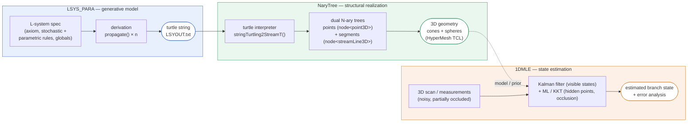

# Branch-Model State Estimation — Architecture

Project: **"Development of a method for estimating the state of a branch model"**
— Elad Gips, Technion, Center for Agricultural Engineering Research.

This document is the single place that captures the *big picture* and how the
three code repositories fit together. Each repo also has its own detailed
`README.md`.

---

## 1. The goal in one paragraph

Computerized plant models let researchers test responses to treatments and
climate cheaply, versus field trials. A powerful sub-class is the
**Functional–Structural Plant Model (FSPM)**, which couples *structure*
(branches, fruits, geometry) with *function* (photosynthesis, water regime) and
their interactions. The price of that detail is **added uncertainty**. Existing
work calibrates model *parameters* and improves average behaviour, but does not
handle the *private, random phenomena* of an individual plant's growth — so a
**state estimator** is needed. The **end goal is whole-tree / whole-plant state
estimation against 3D scan measurements**. The work realized so far delivers the
**proof of concept: a state estimator for a single growing branch** — the branch
is represented as a set of points with growth functions along it, and its true
3D state is recovered from measurements that are **noisy** and **partially
occluded** (points hidden behind foliage in a 3D scan). That estimator combines a
**Kalman filter** (for observed states) with **Maximum Likelihood Estimation**
(for hidden/occluded points and segments). Target applications are orchard
mechanization and robotics: biomass and leaf-area estimation, and fruit
detection for robotic pollination, thinning, and harvesting.

> **Read this first (scope):** the supporting write-up scopes the *method that
> was built* to a **single branch**. The **whole-plant** estimation goal above is
> the project's stated direction, not something the current code or documents
> solve yet. See §2 for exactly where that boundary falls and what generalizing
> it entails.

---

## 2. Scope & roadmap: from single branch to whole plant

**End goal:** estimate the state of a *whole tree / plant* against 3D scan
measurements. **Built so far:** the single-branch estimator (a 1-D chain of
points). A single branch is one branch of the bigger picture — the intended
system estimates the full plant.

Where the boundary actually falls in this codebase:

| Stage | Whole-plant already? | Notes |
|---|---|---|
| **LSYS_PARA** (generative) | ✅ yes | L-systems naturally derive an entire tree; branching is just `[ ]` in the grammar. |
| **NaryTree** (structural) | ✅ yes | It literally builds an **N-ary tree** of points/segments — a whole crown, not one branch. |
| **1DMLE** (estimation) | ❌ single branch | The estimator is a **1-D chain** of points. This is the piece scoped to one branch, and the piece to generalize. |

So "full tree vs measurements" is **mostly an estimation-side extension** — the
generative and structural stages already represent whole plants. The genuinely
new problems that appear only at tree scale:

* **Data association** across the whole crown — which measured point corresponds
  to which model node (trivial-ish on a lone branch, hard on a full tree).
* **Global vs per-branch parameters** — which growth parameters are shared across
  the plant and which vary per branch/organ.
* **Occlusion at tree scale** — far more, and structured, self-occlusion than on
  a single branch; the ML/KKT hidden-point machinery must scale accordingly.
* **A hierarchical / graph estimator** — replace the 1-D Kalman chain with a
  tree-structured filter or factor graph over the whole branching topology,
  fusing per-branch estimates with the shared structure.

Practical implication: extending to whole plants means generalizing **1DMLE**
(and its interface to NaryTree's tree), not rewriting the generative or
structural stages.

---

## 3. The pipeline

A standalone image version is in [`pipeline.svg`](./pipeline.svg) for slides.

---

## 4. The three stages

### Stage 1 — `LSYS_PARA` (generative model)

Parses and runs **parametric, stochastic L-systems**. Production rules rewrite
an axiom over *n* steps into a bracketed **turtle string** encoding the branch's
topology and per-organ parameters. Stochastic successors give each run a
different-but-governed instance — this is where the individual-plant randomness
enters. Uses **exprtk** to evaluate parametric expressions. *Output:*
`LSYOUT.txt`.

→ Details: [`LSYS_PARA`](https://github.com/elgips/LSYS_PARA)

### Stage 2 — `NaryTree` (structural realization)

Interprets the turtle string with a standard **turtle-graphics** interpretation
(yaw/pitch/roll about a Heading/Left/Up frame, `[`/`]` for branches, `!` for
width). It builds **two parallel N-ary trees** — one of 3D *points* (nodes) and
one of *stream-lines* (segments with an orientation frame and a width) kept in
registration — then exports the branch as solid cones + spheres
(Altair/HyperMesh TCL) for meshing / visualization. This is the concrete
geometric realization of "a branch as points with growth functions along it".

→ Details: [`NaryTree`](https://github.com/elgips/NaryTree)

### Stage 3 — `1DMLE` (state estimation)

The estimation math. A **Kalman filter** tracks the states that are directly
observed; where points or segments are **occluded**, their positions are
recovered by **1-D Maximum Likelihood Estimation** with **KKT** optimality
conditions, subject to lower/upper bounds. The plot artifacts from the
supporting documents (`ND_KF`, `std_error_KFND`, `hidden_*_before/after`,
probability-density figures) are this stage's results.

> **Status:** the `1DMLE` repository was not accessible when these guides were
> written (private or renamed). Its *role* is documented here from the
> presentation and the `ML_KKT` write-up; the code walkthrough is still to be
> filled in once the repo is reachable. Make it public / share the URL and this
> section can be expanded to match the other two.

---

## 5. Data contract between stages

| Boundary | Artifact | Format |
|---|---|---|
| LSYS_PARA → NaryTree | `LSYOUT.txt` | turtle string, e.g. `F(0.02)+F(0.03)[--F(0.03)]+F(0.04)` |
| NaryTree → downstream | `Streams.txt`, `Points.txt` | Altair/HyperMesh TCL (`*solidcone`, `*solidspherefull`, …) |
| measurements → 1DMLE | 3D scan / point cloud | noisy, partially occluded point set |
| 1DMLE → output | estimated states + error plots | — |

The turtle-string vocabulary (`F + - & ^ \ / ! [ ]`, optional `(value)`) is the
key shared interface: LSYS_PARA emits it, NaryTree consumes it. Keep them in
sync if you extend the symbol set.

---

## 6. Source documents (authoritative background)

Kept outside the code repos (the "TESTI" bundle):

* **Conference presentation** — *"Development of a method for estimating a branch
  model"* (motivation, FSPM context, uses in robotics/mechanization).
* **Write-up** — *"Development of a method for estimating the state of a branch
  model"* (the abstract/method: branch as points-with-growth-functions; KF + MLE
  for visible and hidden states).
* **`ML_KKT` document** — the maximum-likelihood + KKT solution to the occlusion
  ("hidden point") problem; the probability-density notes.
* **Figures folder** — KF/measurement error comparisons, hidden-point
  before/after, standard-deviation plots.
* **Point-cloud reference image** — a single spruce tree from terrestrial laser
  scanning, illustrating the measurement input.

When you return to this project, read the presentation first for the *why*, then
each repo's README for the *how*.
